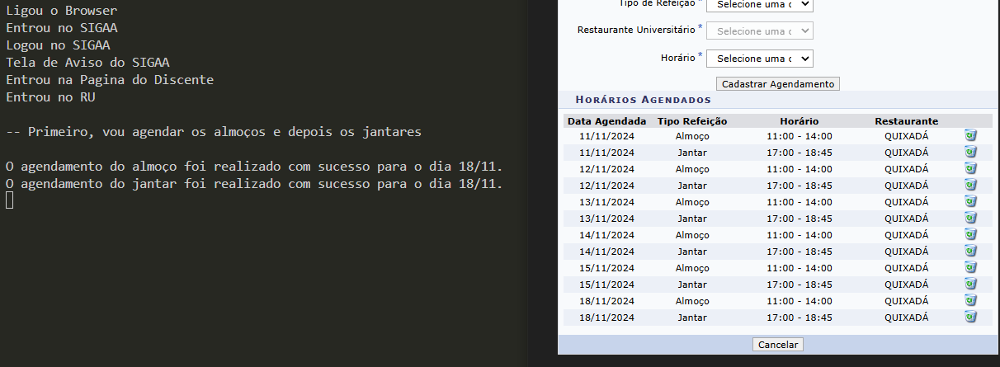
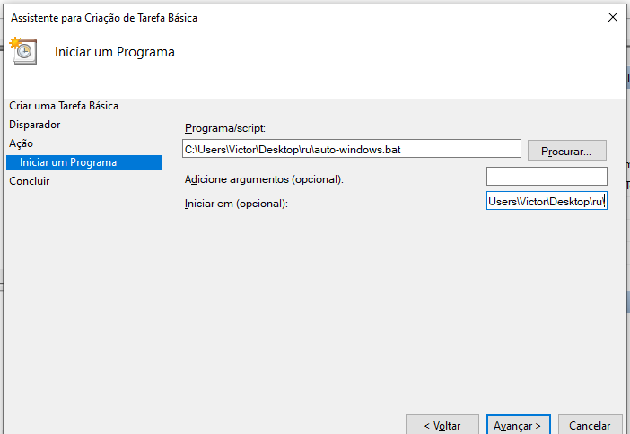

# Agendador Automático do RU (Restaurante Universitário)



## Dependências

Antes de rodar o projeto, você precisará ter as seguintes dependências instaladas:

- **Node.js**: Ambiente de execução JavaScript.
- **Puppeteer**: Biblioteca Node.js para automação de navegação em páginas web via Chromium.

## Como Configurar e Utilizar

### 1. Clone o repositório

```sh
git clone git@github.com:vistomia/ru.git
```

### 2. Instale as Dependências

Certifique-se de que o Node.js está instalado em seu sistema. Em seguida, instale as dependências do projeto:

```sh
npm install
```

### 3. Configure as Credenciais

Abra o arquivo `config-example.json`, edite com suas informações de login e preferências, e depois renomeie para `config.json`.

### 4. Executando o Agendador

Abra a pasta principal e rode:

```sh
node index.js
```

## 5. (opcional) Agendamento Automático

### Windows

Vá no `config.json` e altere o valor da chave `executavelSomenteUmaVezPorDia` para `true`.

Use o Agenda de Tarefas do Windows para agendar a execução do script diariamente. Abra o Agenda de Tarefas, clique em "Criar Tarefa Básica" e siga as instruções.

Gosto de rodar o script toda vez que logar no Windows. Selecione "Ao fazer logon" e clique em "Avançar".

Quando estiver na opção "Iniciar um programa", selecione o arquivo `auto-windows.bat` na pasta do projeto. Em seguida, copie todo o caminho do diretório (exceto o arquivo auto-windows.bat) e cole-o no campo "Iniciar em (opcional)".



### Linux

Ainda não sei como rodar o projeto no Linux.

# Notas Adicionais

    Segurança: Não compartilhe o arquivo config.json, pois ele contém suas credenciais.
    Requisitos de Sistema: O Puppeteer requer um sistema com suporte ao Chromium ou uma versão do Google Chrome instalada.
    Ajustes: Caso o layout da página do RU seja alterado, o código pode precisar de ajustes.
